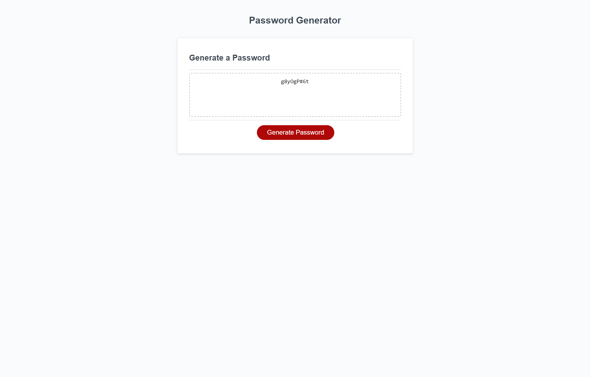

# random-password-generator

## Description
This random password generator was created to randomly generate secure passwords based on the choices of characters chosen by the user. This assignment helped me feel more comfortable using Javascript and Javascript functions.

## Credits
Starter code: https://github.com/coding-boot-camp/friendly-parakeet
MDN Web Docs on Javascript: https://developer.mozilla.org/en-US/docs/Web/JavaScript

## Screenshot

## Link to deployed application
https://elbringz.github.io/random-password-generator/